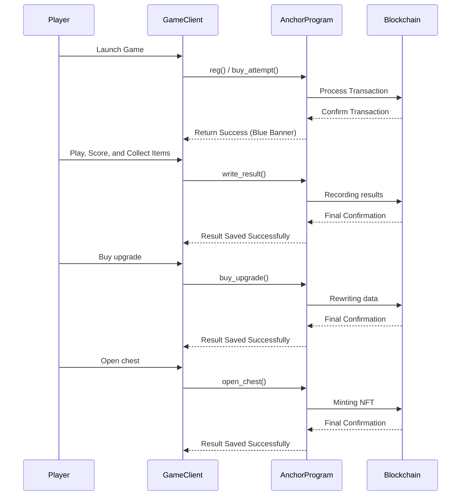

# Orbit 🚀

A hyper-casual, fast-paced blockchain game that takes you on an interstellar adventure! Dodge obstacles, collect rings, and upgrade your rocket with exclusive NFT skins.

---

## ⚠️ Warning

**IMPORTANT:** Due to the high in-game prices, an extra **+25,000 points** will be added to your score after each attempt. This bonus is solely for the review process of the Sonic & the Mobius Hackathon judges.

---

## 🎨 General Images


*Embark on your cosmic journey with Orbit!*

---

## 🌟 Features

- **Blockchain Integration:** enjoy seamless blockchain connectivity via the Sonic SVM layer for secure asset ownership and transparent gameplay.
- **NFT Collectibles:** collect and trade unique rocket skins as NFTs to customize your experience.
- **Competitive Leaderboards:** compete with others using immutable, blockchain-backed score records.
- **Dynamic Upgrades:** strategically enhance your rocket with multiple upgrade paths for speed, boosters, etc.
- **Rocket Selection:** choose from various rocket types—each with unique bonuses — to tailor your playstyle.
- **Robust Token Economy:** in-game fees contribute to a liquidity pool, ensuring a sustainable and rewarding ecosystem.

---

## 🛠️ Getting Started

### Install on Android 📱

1. **Download the APK:**
   - [Repository Link](https://github.com/mat-shur/orbit-sonic/blob/main/android_export/Orbit.apk)
   - or [Google Drive](https://drive.google.com/file/d/1d5hi5XBz_7hdl-tOJlFdXPP1QTIw_GUy/view?usp=sharing)
2. **Install the APK:**
   - Transfer the file to your Android device.
   - Open the APK and follow the on-screen instructions.

### Play via Godot Engine 🖥️

1. **Download Godot 4.3:**  
   [Godot Engine Download](https://godotengine.org/download/windows/)
2. **Download the Game Project:**  
   [Repository Folder](https://github.com/mat-shur/orbit-sonic/tree/main/godot_project)
3. **Import & Run:**  
   Open Godot, import the project, and hit **Play**.

### Play on Windows 💻

*Note: This option is a fallback. Testing on Android is highly recommended.*

1. **Download the Windows Folder:**  
   [Repository Folder](https://github.com/mat-shur/orbit-sonic/tree/main/windows_export)
2. **Run orbit.exe:**  
   Execute the file to start the game.

---

## 🎮 How to Play

1. **Game will automatically send SOL into your in-game wallet, but you can drop additional SOL:**
   - Click your in-game wallet to copy the address (also you will be able to see your balance).
   - Acquire SOL from the [Sonic Faucet](https://faucet.sonic.game/#/).
2. **Register:**
   - Hit the **Register** button to create your account.
3. **Purchase a Game Attempt:**
   - Click **Buy New Try** to purchase an attempt using SOL.
4. **Start the Game:**
   - Click **Start** and use the joystick to control your rocket.
5. **Collect:**
   - Gather coins, stars, and boosters to boost your score.
6. **Game Over:**
   - Choose to save your result (which consumes an attempt) or replay for a better score.
7. **Spend money:**
   - In main menu choose "Upgrade" or "Rockets" to buy upgrade or obtain new rocket.

---

## 🎥 Demo Video

[Watch the Demo Video](https://youtu.be/9jFIElA1t7g)
*Get a glimpse of the Orbit experience!*

---

## 🎮 About My Game

Where did I get the idea for this game? I took a deep dive into the world of the crypto community and noticed the most important phrase of all crypto enthusiasts: **"To the moon!"** Every self-respecting person, when buying something (be it a meme coin, NFT, altcoin, BTC, etc.), always thinks "to the moon" as they update the chart every 5 minutes. This is the core, the base, the foundation.

That's why I present to you a game where the main goal is to fly upwards, *just like a Sonic token after the release of the mainnet*. However, every asset can't just fly upwards, it faces obstacles like FUD (Fear, Uncertainty, and Doubt), panic, bad news in the real world. I brought this into the game in the form of space objects that try to knock down the player, and you need to dodge and fly around them.

but..

I didn't want to make a simple game and just give up on it after the Game Jam.

First, I decided to research the market and saw a very interesting [article](https://android-developers.googleblog.com/2023/07/new-blockchain-based-content-opportunities-google-play.html) about Google allowing blockchain integration in Google Play games. This is my chance! To become the first developer of a Sonic SVM game on Google Play! This was my main motivation during development, it was the reason to do something cool, something working, and exciting. This will be my motivation to complete the project to the end.

I also won't hide the fact that I got my first pang of curiosity when I accidentally noticed this Hackathon with huge $$$ rewards. In fact, I have been dreaming of creating my own game all my life, maybe it's just a childhood dream, because I never finished the job and constantly gave up halfway due to certain life circumstances. However, this event, in my opinion, is my destiny. And Sonic SVM is my opportunity.

---

## 📘 Project Overview | Information for Hackathon

Orbit is developed for the **Sonic & the Mobius Hackathon (Gaming track)**, integrating advanced blockchain mechanics with thrilling, hyper-casual gameplay.

### 🚀 Rocket Types

Choose from a variety of rockets — each with unique bonuses that can dramatically affect your performance. Below is an overview of the available rocket types:

| **Symbol** | **Name**       | **Bonus**                                                                 | **Image** | **Weight** |
|------------|----------------|---------------------------------------------------------------------------|-----------|------------|
| **RKT-SR** | Sonic RUSH     | x2 coins, x1.25 score, More boosters & speed, More gates, Initial 1000 score |  | 1 |
| **RKT-B**  | BNB-cket       | More speed on boosters                                                    |  | 4 |
| **RKT-S**  | Solstar        | 1000 initial score                                                        |  | 4 |
| **RKT-T**  | Tetherion      | More gates on the map                                                     |  | 4 |
| **RKT-E**  | Etherifly      | x1.25 to score                                                            |  | 4 |
| **RKT-3**  | Rocket Phi     | x2 to collected coins                                                     |  | 10 |
| **RKT-2**  | Rocket Eta     | More boosters on the map                                                  |  | 10 |
| **RKT-1**  | Rocket Theta   | Two lives: one more chance                                                |  | 10 |

### ⚙️ Upgrade Types

Enhance your rocket's performance by investing in various upgrade types. Allocate your upgrade points strategically to tailor your gameplay:

| **Upgrade Type** | **Effect**                               | **Description**                                                         |
|------------------|------------------------------------------|-------------------------------------------------------------------------|
| **Speed**        | Increased overall speed                  | Boosts your rocket's top speed to help you outrun obstacles.            |
| **Rotation**     | Enhanced maneuverability                 | Improves turning speed for precise navigation around hazards.           |
| **Boost Time**   | Extended booster duration                | Lengthens the duration of your booster effect for longer power-ups.       |
| **Boost Speed**  | Amplified boost effect                   | Increases the speed multiplier during boost phases to maximize momentum.  |

---

## 🤝 Player Interaction & Community

### Leaderboard & Weekly Rewards

- **Competitive Leaderboards:**  
  Climb the global leaderboard and showcase your skills! Each week, the top players will be rewarded with a share of a pooled fund derived from game commissions and advertising revenue. This weekly reward system not only fuels competition but also ensures that your dedication is generously recognized.

### Daily Quests

- **Engaging Daily Challenges:**  
  Participate in daily quests to earn bonus rewards such as extra coins, temporary power-ups, or upgrade tokens. These quests are designed to add fresh challenges and incentives for regular play, keeping the game exciting and dynamic every day.

---

## 🚀 Roadmap & Future Updates

Like every crypto project, rewarding activities will be at the core of Orbit’s ecosystem. Here’s our planned launch roadmap:

### 0-Season (Testnet)
- **Test & Tweak:**  
  Launch a 0-season on Testnet to rigorously test the security and integrity of the project together with early testers.
- **Feedback Loop:**  
  Collaborate with users to identify and fix bugs, ensuring a robust platform.

### Early Users & Mainnet Launch
- **Early Adopters:**  
  Register successful testers as “Early Users” to acknowledge their participation and provide special benefits.
- **Mainnet Debut:**  
  Officially launch the first season on the Mainnet, opening Orbit to a wider audience with full features enabled.

### Active Marketing & Expansion
- **App Store Launch:**  
  Release Orbit on PlayMarket—and later on iOS — to reach a broad audience.
- **Social Media Outreach:**  
  Kick off active marketing campaigns on TikTok, Instagram, and Google to build brand awareness.
- **Referral Program:**  
  Implement a referral system where influencers can earn a percentage of commissions, spurring organic growth.

### Advertising & Weekly Rewards
- **In-Game Advertising:**  
  Sell advertising space (e.g., custom skins, daily quests, themed planets/stars) to generate revenue.
- **Leaderboard Rewards:**  
  Reward the top 100 leaderboard players weekly by sharing a pool of commissions and ad revenue, with bonus multipliers for “Early Users.”
- **Incentivized Engagement:**  
  Encourage users to promote Orbit on their own channels (Telegram, Twitter, etc.) through attractive rewards.

### Community Engagement & Viral Growth
- **Ongoing Events:**  
  Host community events and challenges to keep engagement high.
- **User-Driven Growth:**  
  Empower users to become ambassadors, leveraging social sharing and word-of-mouth to drive viral growth.
- **Continuous Improvement:**  
  Gather ongoing feedback and update the game to keep the experience fresh and competitive.
---

## 🐞 Known Issues

- **Data Validation:** Limited checks within the game for data integrity.
- **Token Liquidity:** The liquidity pool for the in-game token is not fully implemented.
- **Optimization:** APK size optimization is pending.
- **Content Expansion:** Additional levels, rockets, and challenges are under active development.
- **Sometimes error with RPC connection:** You, probably, need to restart game due this error.

---

## 🔑 Public Keys

- **Leaderboard:** `6EFxBZBRXy98LfMLtU5Z4ufY8fHpNDsEm2Vzzv4yMuwg`
- **Token:** `AH8ayJuAgm3nXX58oMBsFm9s71qbDL4RdrdfQVDPaUDb`
- **Program:** `orbSp1BEce8Tkiha55T6iWrZB2ZX1dipaCxiC5Bybub`
- **Owner:** `orbWh48F9G6UBb5XstTreYGPpRNq9dqhxxdCefQuiws`
- **NFT Collection:** `BV6PRSA9Mz9d6BDT4WqbxRamJnQWHJ48APuCeEKtUvGD`
- **Test user account with in-game assets**: `CdxGhGD1ZQ9cBcd6Av2XjD5G8mWBR9Wy6mnLfy3JMnww`

---

## ⚙️ Anchor Program Information

The backend is powered by an Anchor program written in Rust, which handles player registration, gameplay attempts, score recording, and NFT minting.

### Smart Contract Snippet

```rust
...
...
...
// Purchase an upgrade by transferring tokens from the user to the project owner.
pub fn buy_upgrade(ctx: Context<BuyUpgrade>) -> Result<()> {
    let leaderboard = &mut ctx.accounts.leaderboard;
    let player_pubkey = ctx.accounts.player.key();
    let player = leaderboard.players.iter_mut().find(|p| p.pubkey == player_pubkey)
        .ok_or(OrbitV2Errors::PlayerNotFound)?;

    if player.upgrades >= 24 {
        return Err(OrbitV2Errors::MaxUpgradesReached.into());
    }
    if ctx.accounts.user_token_account.amount < UPGRADE_COST {
        return Err(OrbitV2Errors::InsufficientTokens.into());
    }

    transfer(
        CpiContext::new(
            ctx.accounts.token_program.to_account_info(),
            Transfer {
                from: ctx.accounts.user_token_account.to_account_info(),
                to: ctx.accounts.project_owner_token_account.to_account_info(),
                authority: ctx.accounts.player.to_account_info(),
            },
        ),
        UPGRADE_COST,
    )?;

    player.upgrades += 1;
    Ok(())
}
...
...
...
```

### Mermaid Diagram



---

## 🙏 Acknowledgements

- [Sonic SVM](https://docs.sonic.game) for providing the blockchain layer.
- [Anchor Framework](https://www.anchor-lang.com/) for robust blockchain development.
- [Godot Engine](https://godotengine.org/) for the game development platform.

---

## 👨‍💻 About Me

Hi! I'm [Matvii Shur](https://www.github.com/mat-shur), a passionate developer who turned a childhood dream into reality. Combining the worlds of gaming and blockchain, I create experiences that challenge the norm and push the boundaries of interactive entertainment.

---

## 📫 Contact

- **Email:** [matshur220@gmail.com](mailto:matshur220@gmail.com)
- **Twitter:** [@Bredemar12](https://x.com/Bredemar12)
- **Discord:** @matvij5967
- **Telegram:** [@elizsfic](https://t.me/elizsfic)

---

Thank you for exploring **Orbit**! Let’s defy gravity and soar among the stars together! 🚀🌟
